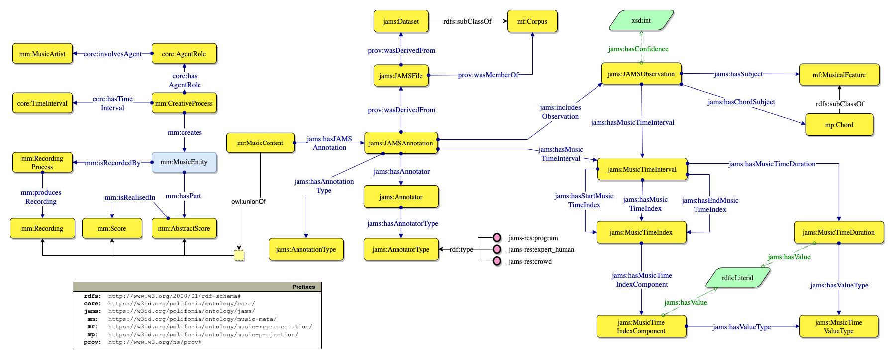

# Music Annotation Ontology
The Music Annotation module provides different music annotation models to accommodate musicological and information retrieval use cases.

> 🔗 Ontology URI: [https://w3id.org/polifonia/ontology/music-annotation/](https://w3id.org/polifonia/ontology/music-annotation/)

The primary objective of this module is to enhance support for other descriptional systems, thus increasing interoperability and conversion possibilities from various music annotation formats.
Indeed, all our models are logically interconnected through Music Representation. 

### JAMS Ontology

A fully fledged annotation model here is the [JAMS Ontology](https://github.com/polifonia-project/jams-ontology).
This ontology mimics the structure of a JAMS (JSON Annotated Music Specification for Reproducible MIR Research) document.
It semantically describes and connects all the elements of the JAMS specification (Annotatio, Observation, etc.),  including the music metadata and the annotation contents using the [Music Meta](https://github.com/polifonia-project/music-meta-ontology) and [Music Representation](https://github.com/polifonia-project/music-representation-ontology) modules, respectively.

## Competency questions addressed

| **ID**   | **Competency question**                                                                                            |
| -------- | ------------------------------------------------------------------------------------------------------------------ |
| **CQ1**  | What is the content of the observations contained in a JAMS Annotation?                                            |
| **CQ2**  | Who is the composer of a musical object?                                                                           |
| **CQ3**  | Who is the performer of a musical object?                                                                          |
| **CQ4**  | Who/what is the annotator of an annotation/observation, and what is its type?                                      |
| **CQ5**  | What is the time frame addressed by an annotation, within a musical object?                                        |
| **CQ6**  | What is its start time \(i\.e\. the starting time of the time frame\)?                                             |
| **CQ7**  | Which are the observations included in an annotation?                                                              |
| **CQ8**  | Given an observation, what is the starting point of the time frame it addresses, within its target musical object? |
| **CQ9**  | Given an observation, what is its addressed time frame, within its target musical object?                          |
| **CQ10** | What is the key of a composition/performance?                                                                      |
| **CQ11** | What is the value of an observation?                                                                               |
| **CQ12** | What is the confidence of an observation?                                                                          |
| **CQ13** | What are the chords of a composition/performance?                                                                  |           

## Related ontologies

### Direct imports
- [JAMS Onotlogy](https://w3id.org/polifonia/ontology/jams)

### Indirect imports
- [Core Onotlogy](https://w3id.org/polifonia/ontology/core)
- [Musi Meta Onotlogy](https://w3id.org/polifonia/ontology/music-meta)
- [Music Representation Onotlogy](https://w3id.org/polifonia/ontology/music-representation)
- [Music Projection Onotlogy](https://w3id.org/polifonia/ontology/music-projection)

## Statistics
We report the following statistics for the Music Annotation module: 
- number of classes: 208 
- number of object properties: 207
- number of datatype properties: 27
- number of logical axioms: 1237

## License

This work is licensed under a
[Creative Commons Attribution 4.0 International License][cc-by].

[cc-by]: http://creativecommons.org/licenses/by/4.0/

## References

[1] Eric J. Humphrey, Justin Salamon, Oriol Nieto, Jon Forsyth, Rachel M. Bittner, and Juan P. Bello, "JAMS: A JSON Annotated Music Specification for Reproducible MIR Research", Proceedings of the 15th International Conference on Music Information Retrieval, 2014.
[2] Harte, Christopher & Sandler, Mark & Abdallah, Samer & Gómez, Emilia. (2005). Symbolic Representation of Musical Chords: A Proposed Syntax for Text Annotations.. 66-71.
